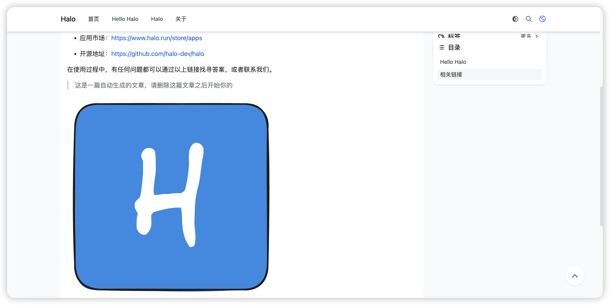
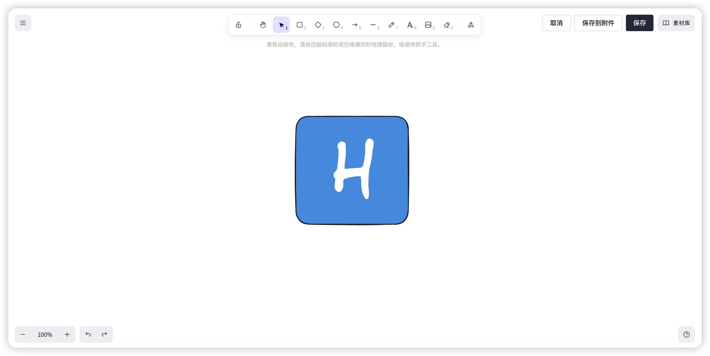
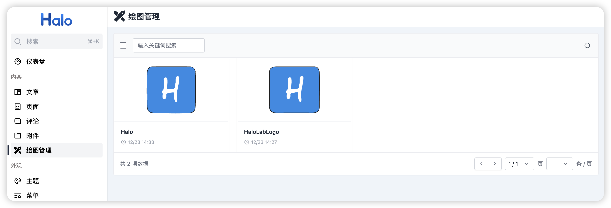

# Excalidraw 绘图插件

为 Halo 2.x 提供 Excalidraw 绘图功能的插件。

## 简介

在 Halo 文章编辑器中集成 [Excalidraw](https://excalidraw.com/) 手绘风格白板，支持创建、编辑和保存绘图，可将 `.excalidraw` 文件上传到附件库备份管理。

## 截图

### 文章渲染



### 绘图编辑器



### 绘图管理



## 开发环境

- Java 21+
- Node.js 18+
- pnpm

## 开发

```bash
# 启用插件
./gradlew haloServer
# 开发前端
cd ui
pnpm install
pnpm dev
```

## 构建

```bash
./gradlew build
```

构建完成后，可以在 `build/libs` 目录找到插件 jar 文件。

## 许可证

[GPL-3.0](./LICENSE) © Handsome 